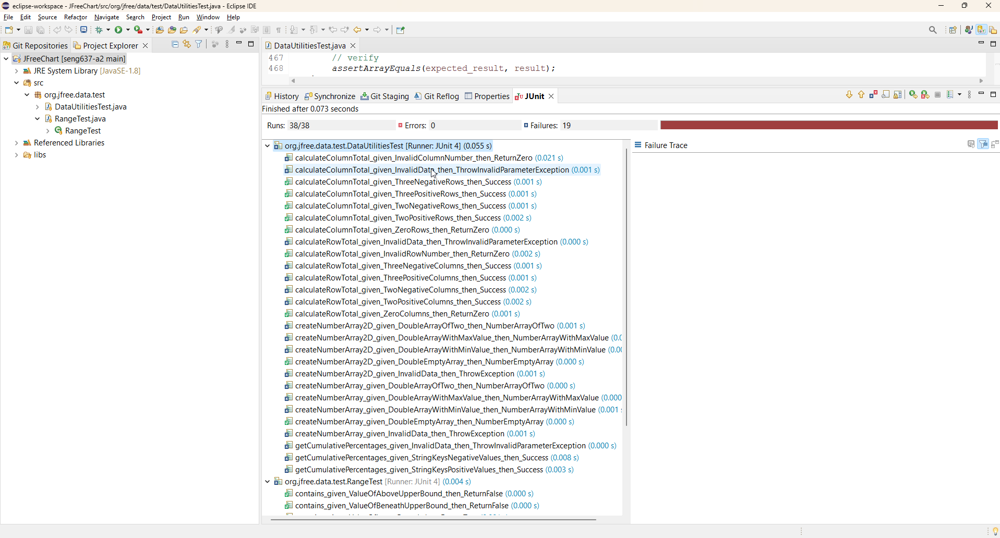

**SENG 637 - Software Testing, Reliability, and Quality**

**Lab. Report \#2 – Requirements-Based Test Generation**

| Group \#:      |   **15**  |
| -------------- | --- |
| Student Names: |Mehrnaz|
|                |Fatemeh|
|                |Sahar|
|                |Alireza|
|                |Sina|
|                |Zahra|

# 1. Introduction



## 1.1. Assignment Goals

In this assignment, we will be focusing on an open-source project named JFreeChart, specifically targeting two of its Java files: Range.java and DataUtilities.java. Our primary objective is to develop unit tests for these files, grounding our tests in the specifications and requirements outlined in the project documentation.

Given that JFreeChart has undergone modifications, it's essential to not only write comprehensive unit tests for both files but also to identify which test cases pass and which do not. The assignment aims to enhance our proficiency in writing unit tests, employing techniques such as boundary value testing, equivalence partitioning, and the use of mocks to simulate behaviors.

By the end of this assignment, you should have a deeper understanding of how to craft effective unit tests in a real-world project setting, leveraging advanced testing strategies to ensure code reliability and functionality.

## 1.2. Goals of Unit Testing

Unit testing is a key software testing method where individual parts of a software are tested in isolation to ensure they work as expected. The main goals of unit testing include:

1. **Ensuring Correct Behavior:** Verifying that each unit operates correctly.
2. **Facilitating Code Refactoring:** Allowing developers to modify code with confidence that existing functionality remains unaffected.
3. **Serving as Documentation:** Providing examples of how to use the software components.
4. **Reducing Bugs:** Catching and fixing errors early in the development process.
5. **Improving Code Quality:** Promoting the writing of clean, maintainable code.
6. **Speeding Up Development:** Making it easier and quicker to add new features without breaking old ones.
7. **Supporting Continuous Integration:** Integrating changes more frequently and reliably.

# 2. Detailed description of unit test strategy

## 2.1. Testing Strategy

Our testing strategy for unit testing involves isolating each part of the program and testing it separately as a black box testing. We use a combination of black-box test-case design techniques such as equivalence classes and boundary value analysis.

### Equivalence Classes

Equivalence classes are used to partition the input data of a program into separate categories where we believe that the program should behave similarly. This allows us to minimize the number of test cases while maximizing the coverage.

### Boundary Value Analysis

Boundary value analysis is a technique where we test the boundaries of the input domain. Errors often occur at the boundaries rather than the center of the input domain.

## 2.2. Test Cases Strategies

Here are some of the test cases we have designed:

### Range Test Cases

**1. getLength():**

- Returns the length of the range. Ranges with zero and non-zero length are considered.
- Partitions and boundaries:
  - Same Lower Bound and Upper Bound
  - Different Lower Bound and Upper Bound

**2. getCentralValue():**

- Returns the central (or median) value for the range. Ranges with zero and non-zero length are considered. 
- Partitions and boundaries:
  - Same Lower Bound and Upper Bound
  - Different Lower Bound and Upper Bound

**3. contains(double value):**

- Returns true if the specified value is within the range and false otherwise. Values inside, on edges and outside the range are considered.
- Partitions and boundaries:
  - Within range
  - Above the upper bound
  - Beneath the lower bound
  - Upper bound
  - Lower bound
  
**4. getLowerBound():**

- Returns the lower bound for the range.
- Partitions and boundaries: LowerBound

**5. getUpperBound():** 

- Returns the upper bound for the range.
- Partitions and boundaries: UpperBound

### Data Utilities Test Cases

**1. calculateColumnTotal(Values2D table, int column ):**

- Returns the sum of the values in one column of the supplied data table. Tables with zero rows, positive row values, negative row values are considered. Also, column number out of range and null table are considered.
- Partitions and boundaries:
  - Table with zero rows and column number zero
  - Table with two rows, each containing positive number and column number zero
  - Table with two rows, each containing negative number and column number zero
  - Table with three rows, each containing positive number and column number zero
  - Table with three rows, each containing negative number and column number zero
  - Table with one row and column number out of range
  - Null table and column number zero

**2. calculateRowTotal(Values2D table, int row ):**

- Returns the sum of the values in one row of the supplied data table.Tables with zero columns, positive column values, negative column values are considered. Also, row number out of range and null table are considered.
- Partitions and boundaries:
  - Table with zero columns and row number zero
  - Table with two columns, each containing positive number and row number zero
  - Table with two columns, each containing negative number and row number zero
  - Table with three columns, each containing positive number and row number zero
  - Table with three columns, each containing negative number and row number zero
  - Table with one column and row number out of range
  - Null table and row number zero

**3. createNumberArray(double[] data):**

- Constructs an array of Number objects from an array of double primitives. Arrays containing positive doubles, min double value and max double value are considered. Also, empty and null arrays are considered.
- Partitions and boundaries:
  - Array of two positive doubles
  - Array containing Double.MIN_VALUE
  - Array containing Double.MAX_VALUE
  - Empty array
  - Null array
  
**4. createNumberArray2D(double[][] data):**

- Constructs an array of Number objects from an array of double primitives.Arrays containing positive doubles, min double value and max double value are considered. Also, empty and null arrays are considered.
- Partitions and boundaries:
  - Array containing two arrays of two positive doubles
  - Array containing Double.MIN_VALUE
  - Array containing Double.MAX_VALUE
  - Empty array
  - Null array

**5. getCumulativePercentages(KeyedValues data):** 

- Returns a KeyedValues instance that contains the cumulative percentage values for the data in another KeyedValues instance. Data sets containing positive numbers, negative numbers are considered. Also, null data is considered.
- Partitions and boundaries: 
  - Four string keys with positive number values
  - Four string keys with negative number values
  - Null data

## 2.3. Mocking

Mocking is a technique where we create a fake or 'mock' object to simulate the behavior of real objects.

### Benefits of Mocking

1. **Isolation**: Mocking allows us to isolate the unit of code we are testing. This ensures that the test only fails when there is a problem with the code under test.
2. **Control**: Mock objects can be easily controlled to return specific values or behaviors, allowing us to test how our code responds to different scenarios.

### Drawbacks of Mocking

1. **Overuse**: Overuse of mocks can lead to tests that are hard to understand and maintain.
2. **False Positives**: If the mock is not an accurate representation of the real object, it can lead to false positives.

## 2.4. Exception Handling

In the provided JUnit 4.x test cases, two strategies are used to handle expected exceptions, given that the standard `expectedException` rule may not work as intended in the library being used.

### Strategy 1: Catch and Ignore Expected Exception

In the `calculateColumnTotal_given_InvalidData_then_ThrowInvalidParameterException` test case, the strategy involves trying to invoke a method that is expected to throw a specific exception (`InvalidParameterException`) when passed invalid data (null in this case). The test is designed to catch the expected `InvalidParameterException` and silently ignore it, which is implied by the empty catch block. This strategy assumes that if the expected exception is thrown, the test should pass, as it behaves as anticipated. However, if any other type of exception is thrown, the test fails explicitly by calling `fail()`, indicating that an unexpected error occurred.

```java
@Test
public void calculateColumnTotal_given_InvalidData_then_ThrowInvalidParameterException() {
    try {
        DataUtilities.calculateColumnTotal(null, 0);
    } catch (InvalidParameterException ex) {
        // Expected exception, test passes
    } catch (Exception ex) {
        fail(); // Unexpected exception, test fails
    }
}
```

### Strategy2: Assert Exception Type

The `getCumulativePercentages_given_InvalidData_then_ThrowInvalidParameterException` test case uses a different approach. It also encloses the method call expected to throw an exception within a try-catch block. However, instead of silently ignoring the expected exception, it asserts the type of the caught exception using `assertEquals()`. This assertion checks if the type of the thrown exception is exactly `InvalidParameterException` as expected. If the thrown exception is of the correct type, the test passes, confirming that the method's error handling behaves as intended. If the exception is of a different type or if no exception is thrown, the test will fail, indicating a deviation from the expected behavior.

```java
@Test
public void getCumulativePercentages_given_InvalidData_then_ThrowInvalidParameterException() {
    try {
        DataUtilities.getCumulativePercentages(null);
    } catch (Exception e) {
        assertEquals("The exception thrown should be InvalidParameterException", InvalidParameterException.class,
                e.getClass()); // Asserts the type of the thrown exception
    }
}
```

Both strategies are effective for testing exception handling in scenarios where the `expected exception` rule may not be suitable or available. They ensure that the code under test not only throws an exception in error conditions but also throws the correct type of exception, adhering to the defined error handling contract.

## 2.5. Conclusion

Through a combination of equivalence classes, boundary value analysis, mocking, and exception handling, we have created a comprehensive suite of unit tests for the JFreeChart library. This ensures that our code is robust, reliable, and behaves as expected under a wide range of conditions.

# 3. Test cases developed

## 3.1. Range Test Cases

| Method          | Test Case Name                                                        | Range  | Input | Pass/Fail |
|-----------------|-----------------------------------------------------------------------|--------|-------|-----------|
| getLength       | getLength_set_DifferentLowerBoundUpperBound_then_ReturnLength         | (-1,1) | -     | PASS      |
| getLength       | getLength_set_SameLowerBoundUpperBound_then_ReturnLength              | (1,1)  | -     | PASS      |
| getCentralValue | getCentralValue_set_DifferentLowerBoundUpperBound_then_ReturnCentralValue | (-1,1) | -     | PASS      |
| getCentralValue | getCentralValue_set_SameLowerBoundUpperBound_then_ReturnCentralValue  | (1,1)  | -     | PASS      |
| contains        | contains_given_ValueOfWithinRange_then_ReturnTrue                     | (-1,1) | 0     | PASS      |
| contains        | contains_given_ValueOfLowerBound_then_ReturnTrue                      | (-1,1) | -1    | PASS      |
| contains        | contains_given_ValueOfUpperBound_then_ReturnTrue                      | (-1,1) | 1     | PASS      |
| contains        | contains_given_ValueOfAboveUpperBound_then_ReturnFalse                | (-1,1) | 2     | PASS      |
| contains        | contains_given_ValueOfBeneathUpperBound_then_ReturnFalse              | (-1,1) | -2    | PASS      |
| getLowerBound   | getLowerBound_set_LowerBoundNegativeUpperBoundPositive_then_ReturnLowerBound | (-1,1) | -     | PASS      |
| getUpperBound   | getUpperBound_set_LowerBoundNegativeUpperBoundPositive_then_ReturnUpperBound | (-1,1) | -     | FAIL      |

## 3.2. Data Utilities Test Cases

| Method                          | Test Case                                              | Input                                                  | Result |
|---------------------------------|--------------------------------------------------------|--------------------------------------------------------|--------|
| calculateColumnTotal            | calculateColumnTotal_given_ZeroRows_then_ReturnZero    | Values2D with 0 rows                                   | PASS   |
| calculateColumnTotal            | calculateColumnTotal_given_TwoPositiveRows_then_Success| Values2D with 2 rows, positive values                  | PASS   |
| calculateColumnTotal            | calculateColumnTotal_given_TwoNegativeRows_then_Success| Values2D with 2 rows, negative values                  | PASS   |
| calculateColumnTotal            | calculateColumnTotal_given_ThreePositiveRows_then_Success| Values2D with 3 rows, positive values                | PASS   |
| calculateColumnTotal            | calculateColumnTotal_given_ThreeNegativeRows_then_Success| Values2D with 3 rows, negative values                | PASS   |
| calculateColumnTotal            | calculateColumnTotal_given_InvalidColumnNumber_then_ReturnZero| Values2D with 1 row, invalid column index          | FAIL   |
| calculateColumnTotal            | calculateColumnTotal_given_InvalidData_then_ThrowInvalidParameterException| null input for values           | FAIL   |
| calculateRowTotal               | calculateRowTotal_given_ZeroColumns_then_ReturnZero    | Values2D with 0 columns                                 | PASS   |
| calculateRowTotal               | calculateRowTotal_given_TwoPositiveColumns_then_Success| Values2D with 2 columns, positive values               | FAIL   |
| calculateRowTotal               | calculateRowTotal_given_TwoNegativeColumns_then_Success| Values2D with 2 columns, negative values               | FAIL   |
| calculateRowTotal               | calculateRowTotal_given_ThreePositiveColumns_then_Success| Values2D with 3 columns, positive values             | FAIL   |
| calculateRowTotal               | calculateRowTotal_given_ThreeNegativeColumns_then_Success| Values2D with 3 columns, negative values             | FAIL   |
| calculateRowTotal               | calculateRowTotal_given_InvalidRowNumber_then_ReturnZero| Values2D with invalid row index                       | PASS   |
| calculateRowTotal               | calculateRowTotal_given_InvalidData_then_ThrowInvalidParameterException| null input for values           | FAIL   |
| createNumberArray               | createNumberArray_given_DoubleArrayOfTwo_then_NumberArrayOfTwo| double array of two elements                          | FAIL   |
| createNumberArray               | createNumberArray_given_DoubleArrayWithMinValue_then_NumberArrayWithMinValue| double array including Double.MIN_VALUE           | FAIL   |
| createNumberArray               | createNumberArray_given_DoubleArrayWithMaxValue_then_NumberArrayWithMaxValue| double array including Double.MAX_VALUE           | FAIL   |
| createNumberArray               | createNumberArray_given_DoubleEmptyArray_then_NumberEmptyArray| empty double array                                    | PASS   |
| createNumberArray               | createNumberArray_given_InvalidData_then_ThrowException| null input for double array                            | FAIL   |
| createNumberArray2D             | createNumberArray2D_given_DoubleArrayOfTwo_then_NumberArrayOfTwo| 2D double array of two elements                    | FAIL   |
| createNumberArray2D             | createNumberArray2D_given_DoubleArrayWithMinValue_then_NumberArrayWithMinValue| 2D double array including Double.MIN_VALUE      | FAIL   |
| createNumberArray2D             | createNumberArray2D_given_DoubleArrayWithMaxValue_then_NumberArrayWithMaxValue| 2D double array including Double.MAX_VALUE      | FAIL   |
| createNumberArray2D             | createNumberArray2D_given_DoubleEmptyArray_then_NumberEmptyArray| 2D double array empty                                 | PASS   |
| createNumberArray2D             | createNumberArray2D_given_InvalidData_then_ThrowException| null input for 2D double array                       | FAIL   |
| getCumulativePercentages        | getCumulativePercentages_given_StringKeysPositiveValues_then_Success| KeyedValues with positive values                  | FAIL   |
| getCumulativePercentages        | getCumulativePercentages_given_StringKeysNegativeValues_then_Success| KeyedValues with negative values                  | FAIL   |
| getCumulativePercentages        | getCumulativePercentages_given_InvalidData_then_ThrowInvalidParameterException| KeyedValues with null value values                  | FAIL   |

# 4. How the team work/effort was divided and managed

## 4.1. Team organization

In this project, we divided into three smaller teams

**Team 1:** Alireza, Sahar, Sina
**Team 2:** Fatemeh, Mehrnaz, Zahra

Before starting to test the classes, we first discussed some important aspects of writing test cases. We discussed the test plan and our testing approach, documenting both for clarity and reference. Our discussion covered naming conventions for test cases and how to handle exceptional values consistently across all test cases.

The project involved two parts for testing: creating test cases for all 5 methods of org.jfree.data.DataUtilities and selecting 5 out of 15 methods for org.jfree.data.Range. Team 1 wrote tests for the DataUtilities class, while Team 2 wrote tests for the Range class. Each group worked independently on the class for which they were responsible.
First, group members read the requirements outlined in the Javadocs for each method in the class they were testing. After becoming familiar with each method, teams applied black-box test-case design techniques and discussed equivalence classes and boundary values. Then, the teams wrote the tests.
After completing all the test cases for their respective classes, each team member individually reviewed the test cases. Finally, once Team 1 completed the test cases for the DataUtilities class and Team 2 for the Range class, they reviewed each other's test cases to ensure they covered all boundaries and criteria.

In this project, we also utilized the pull request method on GitHub to review potential changes with collaborators. This involves adding follow-up commits before merging your changes into the base branch. Pull requests allow for a collaborative and organized approach to reviewing and incorporating modifications into the project.

## 4.2. Lesson learned from our teamwork on this lab

Following a straightforward approach to peer review and feedback, especially using GitHub pull requests, makes the refinement and improvement of test cases and project outcomes more manageable and less labor-intensive. This strategy allows teams to efficiently address issues, exchange insights, and implement gradual enhancements, reducing the individual workload. Regular, organized reviews create a collaborative environment where team members contribute to the project's evolution, ensuring quality and comprehensiveness with fewer demands on their time and effort. This method underscores the effectiveness of working together in achieving high-quality results, showing that intelligent, structured collaboration can lead to superior outcomes without the necessity for constant hard labor.

# 5. Difficulties encountered, challenges overcome, and lessons learned

## 5.1. Lessons Learned

- The value of teamwork was magnified in our journey, proving essential for navigating the complexities of unit testing, such as identifying appropriate boundaries and partitions. The collaborative environment, enriched by the varied perspectives and shared expertise of our team members, played a pivotal role in surmounting these challenges. This collective approach not only facilitated a more comprehensive understanding of the issues at hand but also significantly propelled our project towards success.
- Mastery of mocking dependencies emerged as a cornerstone lesson, highlighting its critical role in achieving true isolation within unit tests. This technique allowed us to concentrate on testing individual units of code, such as functions, without interference from external systems. By simulating these dependencies, we ensured that each test was a precise and focused examination of the unit in question, thereby enhancing the reliability and effectiveness of our testing efforts.
- Executing each unit test within a second or just a few milliseconds offers the advantage of rapid feedback for code modifications. This swift turnaround allows for immediate validation of changes, ensuring that any adjustments can be quickly verified and incorporated into the development process.

## 5.2. Difficulties Encountered and Challenges Overcome

- Working together as a team had its ups and downs. We sometimes disagreed on how to do things or did not communicate well, which slowed us down. Learning to talk openly and make decisions together was key to moving forward and getting our work done.
- Defining a consistent name format for test cases that covers important information was challenging. It was not only about creating a consistent format but also ensuring that everyone followed it precisely.
- Defining partitions and boundaries for each test method presented a challenge in this project. We had to accurately identify all the partitions to make a test that includes the method's boundaries and functionality.
- Managing the dependencies that methods had together was challenging, and in this case, we had to use mocking to handle the dependencies.
- Facing challenges when a test case fails was common. Since we did not have access to the internal code of each method, when a test case failed, we had to ensure that we did not make any mistakes in writing the test case. The failure of the test case might be excited because of the incorrect implementation of the test case.
  
# 6. Comments/feedback on the lab itself

The lab's documentation is clear and discusses all the steps clearly. The Instructions part in this lab was very useful, especially the part of familiarization that provides step-by-step instructions on how to create an Eclipse project, add necessary libraries, create a simple JUnit test, and a description about Javadoc. This familiarization part helps us save time in setting up the Eclipse environment and getting familiar with all parts of the project.
There were some mistakes in the document. For example, it was mentioned that we have a jfreechart-1.0.19.zip file, but a file with this naming does not exist.

We encountered some errors while importing all the JAR files from the FreeChart folder. Ultimately, by removing the outdated and legacy JAR files, we were able to build and run the project.

**An important feedback while creating the repo:** We encountered difficulties in adding additional contributors to the GitHub repository generated from the classroom template, as the "Settings" tab was missing, preventing collaborative development of unit tests. Consequently, we established a private GitHub repository for our team to collaboratively finalize the project. Upon completion, one team member transferred the changes to the designated classroom repository. As a result, the GitHub repository only displays the contributions of the final team member who transferred the work.
